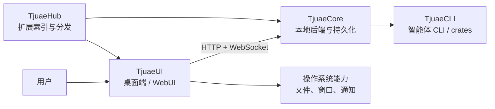
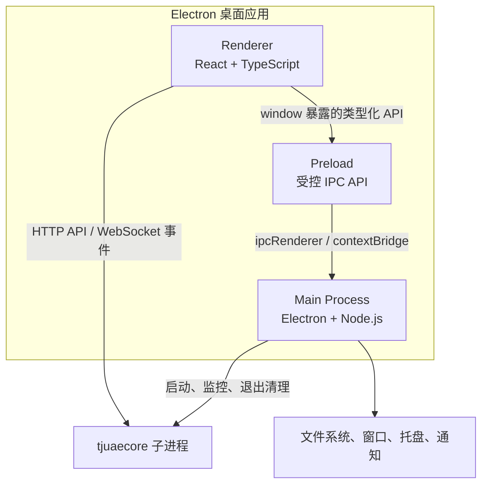
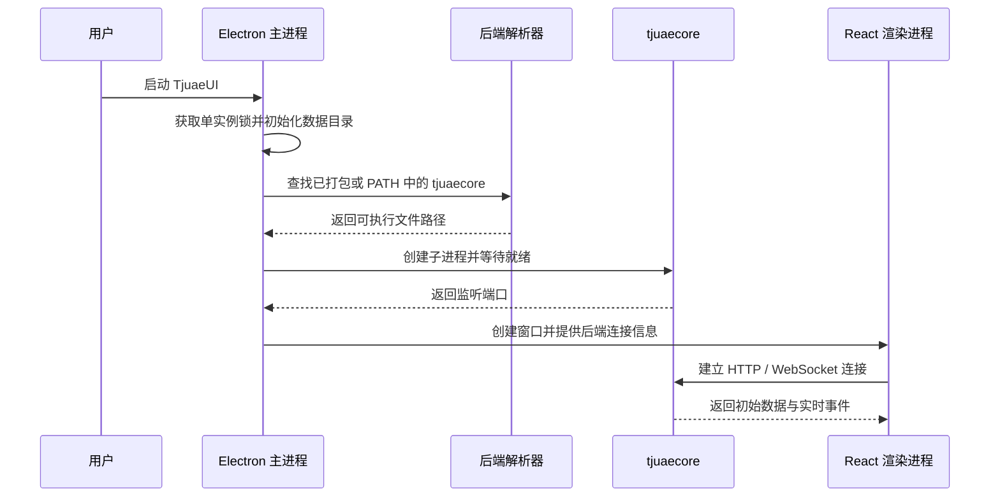
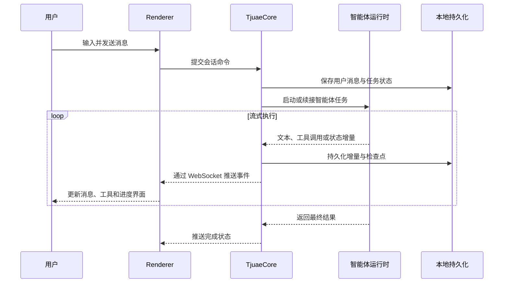
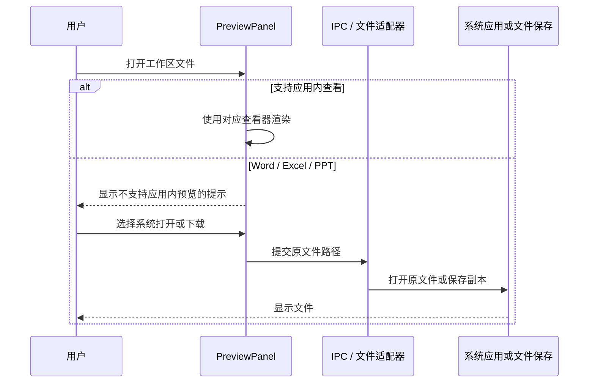
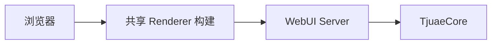

# TjuaeUI 架构总览

本文说明 TjuaeUI 在 Tjuae 多仓库体系中的职责、桌面应用内部的进程边界，以及启动、会话和文件处理的主要运行时流程。

## 1. 仓库职责

| 仓库      | 核心职责                                                        |
| --------- | --------------------------------------------------------------- |
| TjuaeUI   | Electron 桌面端、浏览器 WebUI、交互状态、preload 桥接与前端资源 |
| TjuaeCore | 本地后端、持久化、HTTP/WebSocket API、任务编排和长期运行能力    |
| TjuaeCLI  | Rust 智能体 CLI 及可复用 crates                                 |
| TjuaeHub  | 扩展清单、Schema、索引和可分发扩展包                            |

TjuaeUI 只负责客户端边界。后端业务和持久化能力属于 TjuaeCore；CLI 能力属于 TjuaeCLI；扩展目录与分发规范属于 TjuaeHub。四个仓库可以独立构建、测试和发布。



## 2. TjuaeUI 内部结构

TjuaeUI 是 Electron 多进程应用，核心代码位于 `packages/desktop/src/`。

```text
packages/desktop/src/
├── index.ts       # Electron 主进程入口
├── process/       # 主进程业务、启动、桥接和本地系统能力
├── preload/       # contextBridge / ipcRenderer 安全暴露层
├── renderer/      # React UI，只使用浏览器 API
└── common/        # 跨进程共享类型、协议和适配器
```



### 进程边界

| 层          | 可以使用                       | 禁止使用                               |
| ----------- | ------------------------------ | -------------------------------------- |
| `process/`  | Node.js、Electron 主进程 API   | DOM、React                             |
| `renderer/` | React、DOM、浏览器 API         | `fs`、`path` 等 Node.js API            |
| `preload/`  | `contextBridge`、`ipcRenderer` | 任意业务 UI、无约束的 Node.js 能力暴露 |
| `common/`   | 可序列化类型、协议与环境适配器 | 依赖单一进程环境的实现                 |

渲染进程不得绕过 preload 导入主进程模块。新增特权能力时，应先在主进程实现，再通过窄接口、可序列化参数和明确返回类型暴露。

## 3. 启动流程

桌面开发模式下，TjuaeUI 负责解析并启动 `tjuaecore`。只有获得 Electron 单实例锁的进程可以创建后端子进程，避免多个实例争用同一数据目录。



如果后端资源缺失或启动失败，主进程会收集安装诊断并终止启动；应用不会静默下载未知二进制，也不会在缺失关键资源时继续运行。

## 4. 会话工作流

渲染进程负责用户交互和本地视图状态，TjuaeCore 负责会话、任务和持久化。长连接事件用于推送消息增量、状态变化和文件更新。



## 5. 文件与预览流程

文本、Markdown、HTML、图片和 PDF 由对应的本地查看器处理。Word、Excel 与 PPT 不启动额外的外部预览服务；界面显示明确的安全退化提示，并保留工具栏中的“使用系统应用打开”和“下载”操作。



工作区的 Office 文件新增监听属于通用文件系统能力，只负责发现文件并自动打开标签页，不负责启动文档渲染服务。

## 6. WebUI 模式

WebUI 复用同一套 React 渲染层和 TjuaeCore API。与桌面模式相比，浏览器环境不能调用 Electron 特权 API，因此 `common/adapter/` 会根据运行环境选择浏览器或桌面适配器。



## 7. 技术栈

- 桌面容器：Electron、electron-vite
- 前端：React 19、TypeScript、Arco Design、IconPark
- 样式：UnoCSS、CSS Modules
- 包管理与脚本：Bun、Node.js 22+
- 状态与通信：SQLite、类型化 IPC、HTTP、WebSocket
- 测试：Vitest 4、Testing Library、Playwright

## 8. 代码放置原则

- React 页面、组件、Hooks：`packages/desktop/src/renderer/`
- Electron/Node.js 业务与系统能力：`packages/desktop/src/process/`
- preload 暴露层：`packages/desktop/src/preload/`
- 主进程和渲染进程共享的类型与适配器：`packages/desktop/src/common/`
- 单元、集成、回归与 E2E 测试：`tests/`

更细的目录、命名和测试映射规则见：

- [文件与目录结构](../contributing/file-structure.md)
- [架构技能](../../.claude/skills/architecture/SKILL.md)
- [渲染层规则](../../.claude/skills/architecture/references/renderer.md)
- [主进程与共享层规则](../../.claude/skills/architecture/references/process.md)
