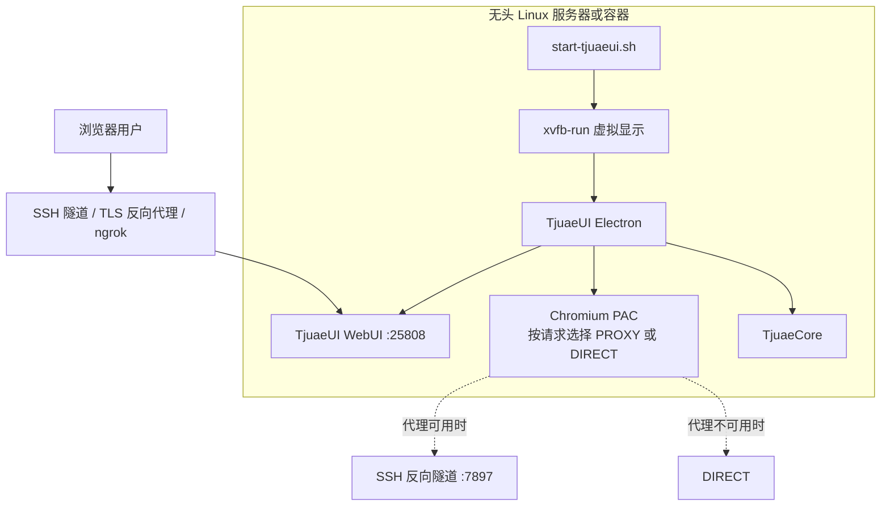

# TjuaeUI 无头服务器部署指南

本文说明如何在无图形界面的 Linux 服务器、云主机、Kubernetes Pod 或容器中部署 TjuaeUI WebUI，并配置按请求自动回退的代理。

## 前置条件

- Linux x86_64，推荐 Ubuntu 20.04+ 或 Debian 11+
- 至少 2 GB 内存
- TjuaeUI `.deb` 安装包（[Release 页面](https://github.com/liangboqiang/TjuaeUI/releases)）

## 安装

```bash
# 解析并下载最新 x64 .deb
TAG=$(curl -fsSL https://api.github.com/repos/liangboqiang/TjuaeUI/releases/latest \
  | sed -n 's/.*"tag_name": *"\([^"]*\)".*/\1/p')
VERSION="${TAG#v}"
wget "https://github.com/liangboqiang/TjuaeUI/releases/download/${TAG}/TjuaeUI-${VERSION}-linux-x64.deb"

# 安装
sudo dpkg -i "TjuaeUI-${VERSION}-linux-x64.deb"
sudo apt-get install -f
```

> 容器中如果因 `libegl1` 或 `libgles2` 出现依赖错误（NVIDIA runtime 中较常见），可以用 `sudo dpkg --force-all -i <package>` 强制安装，但随后仍应确认全部运行时库真实存在。

## 虚拟显示（Xvfb）

TjuaeUI 是 Electron 应用，即使只使用 WebUI 也需要 display server。无头服务器应安装 Xvfb：

```bash
sudo apt-get install -y xvfb libxkbcommon-x11-0
```

下文脚本通过 `xvfb-run` 自动创建虚拟显示。

## 服务管理脚本

许多容器环境没有 systemd，可以使用基于 `nohup` 的管理脚本。创建 `/opt/TjuaeUI/start-tjuaeui.sh`：

```bash
#!/bin/bash
# TjuaeUI WebUI 无头启动脚本
# 用法：./start-tjuaeui.sh [start|stop|restart|status]

PIDFILE="/var/run/tjuaeui.pid"
LOGFILE="/var/log/tjuaeui.log"
WORKDIR="$HOME" # 改成允许 TjuaeUI 操作的工作目录

start() {
    if [ -f "$PIDFILE" ] && kill -0 "$(cat "$PIDFILE")" 2>/dev/null; then
        echo "TjuaeUI 已在运行（PID：$(cat "$PIDFILE")）"
        return 1
    fi

    echo "正在启动 TjuaeUI WebUI..."
    cd "$WORKDIR" || return 1

    nohup xvfb-run --auto-servernum --server-args="-screen 0 1920x1080x24" \
        /usr/bin/TjuaeUI --webui --remote --no-sandbox \
        > "$LOGFILE" 2>&1 &

    echo $! > "$PIDFILE"
    sleep 3

    if kill -0 "$(cat "$PIDFILE")" 2>/dev/null; then
        echo "TjuaeUI 启动成功（PID：$(cat "$PIDFILE")）"
        echo "WebUI：http://$(hostname -I | awk '{print $1}'):25808"
    else
        echo "TjuaeUI 启动失败，请查看日志：$LOGFILE"
        rm -f "$PIDFILE"
        return 1
    fi
}

stop() {
    if [ ! -f "$PIDFILE" ]; then
        echo "TjuaeUI 未在运行"
        return 1
    fi

    PID=$(cat "$PIDFILE")
    echo "正在停止 TjuaeUI（PID：$PID）..."
    kill "$PID" 2>/dev/null
    sleep 2

    if kill -0 "$PID" 2>/dev/null; then
        kill -9 "$PID" 2>/dev/null
    fi

    rm -f "$PIDFILE"
    echo "TjuaeUI 已停止"
}

restart() {
    stop
    sleep 1
    start
}

status() {
    if [ -f "$PIDFILE" ] && kill -0 "$(cat "$PIDFILE")" 2>/dev/null; then
        echo "TjuaeUI 运行中（PID：$(cat "$PIDFILE")）"
        ss -tlnp | grep 25808
    else
        echo "TjuaeUI 未在运行"
        rm -f "$PIDFILE" 2>/dev/null
    fi
}

case "${1:-start}" in
    start) start ;;
    stop) stop ;;
    restart) restart ;;
    status) status ;;
    *) echo "用法：$0 {start|stop|restart|status}" ;;
esac
```

```bash
sudo chmod +x /opt/TjuaeUI/start-tjuaeui.sh
sudo /opt/TjuaeUI/start-tjuaeui.sh start
```

`WORKDIR` 决定 TjuaeUI 默认可访问的工作目录，应设置为实际项目目录，不要无意中扩大文件访问范围。

## 远程访问

打包后的 WebUI 默认监听 **25808**。按网络环境选择方式：

### 方案 A：SSH 本地隧道（推荐个人使用）

在本地电脑执行：

```bash
ssh -L 25808:127.0.0.1:25808 user@YOUR_SERVER_IP
```

随后访问 `http://localhost:25808`。该方案无需将服务直接暴露到公网。

### 方案 B：反向代理与 TLS（推荐长期服务）

使用 Nginx、Caddy 或受管网关终止 TLS，再代理到 `127.0.0.1:25808`。同时：

- 配置强管理员密码
- 只开放 80/443 等必要端口
- 限制来源 IP 或接入 VPN/零信任网关
- 正确代理 WebSocket

不要直接在公网长期暴露明文 HTTP。

### 方案 C：ngrok（NAT、K8s 或临时演示）

```bash
pip3 install pyngrok
ngrok config add-authtoken YOUR_TOKEN

nohup ngrok http 25808 --log=stdout > /var/log/ngrok.log 2>&1 &

curl -s http://127.0.0.1:4040/api/tunnels | python3 -c "
import sys, json
[print(t['public_url']) for t in json.load(sys.stdin)['tunnels']]
"
```

ngrok 免费方案通常会在重启后更换 URL；长期使用时应在 [ngrok dashboard](https://dashboard.ngrok.com/) 配置固定域名。

### 方案 D：直接公网访问

只适合已有外围访问控制的环境。开放安全组/防火墙的 25808 端口后访问 `http://YOUR_SERVER_IP:25808`。必须评估明文 HTTP 与公网暴露风险。

## 代理自动回退

服务器需要通过代理访问部分 API 时，可以通过 SSH 反向隧道连接本地代理，并使用 PAC 实现“代理优先、不可用时直连”。切换按请求发生，无需重启。

### 第 1 步：建立 SSH 反向隧道

在本地电脑执行：

```bash
ssh -R 7897:127.0.0.1:7897 user@YOUR_SERVER_IP
```

将 `7897` 替换为实际代理端口。SSH 会话保持期间，服务器的 `127.0.0.1:7897` 会转发到本地。

### 第 2 步：为 Electron/Chromium 配置 PAC

固定 `--proxy-server` 在代理中断后会让全部请求失败，因此应改用 PAC。创建 `/opt/TjuaeUI/proxy.pac`：

```javascript
function FindProxyForURL(url, host) {
  if (
    isPlainHostName(host) ||
    host === '127.0.0.1' ||
    host === 'localhost' ||
    shExpMatch(host, '10.*') ||
    shExpMatch(host, '192.168.*') ||
    shExpMatch(host, '172.16.*')
  ) {
    return 'DIRECT';
  }
  return 'PROXY 127.0.0.1:7897; DIRECT';
}
```

在启动命令中添加：

```bash
--proxy-pac-url="file:///opt/TjuaeUI/proxy.pac"
```

`PROXY 127.0.0.1:7897; DIRECT` 表示先尝试代理，连接被拒绝或超时后自动直连。局域网地址始终直连。

### 第 3 步：Shell 命令自动检测代理

`curl`、`wget` 等读取代理环境变量。可以在 `~/.bashrc` 中按端口可达性动态设置：

```bash
# === Proxy Auto-Detect ===
_auto_proxy() {
    if (echo > /dev/tcp/127.0.0.1/7897) 2>/dev/null; then
        export http_proxy=http://127.0.0.1:7897
        export https_proxy=http://127.0.0.1:7897
        export ALL_PROXY=socks5://127.0.0.1:7897
    else
        unset http_proxy https_proxy ALL_PROXY 2>/dev/null
    fi
}
_auto_proxy
PROMPT_COMMAND="_auto_proxy;${PROMPT_COMMAND}"
# === Proxy Auto-Detect End ===
```

`PROMPT_COMMAND` 会在每次显示 shell 提示符前检查代理端口。隧道连接时自动设置变量，中断时自动清除。

### 第 4 步：配置提供商专用代理

部分提供商调用由 Node.js 层独立处理。需要时在 TjuaeUI 对应提供商设置中填写 `http://127.0.0.1:7897`。该配置与 Chromium PAC 相互独立。

## 故障排查

| 问题                     | 处理方式                                                   |
| ------------------------ | ---------------------------------------------------------- |
| 容器内 `dpkg` 依赖报错   | 修复仓库依赖；确认风险后再使用 `dpkg --force-all -i`       |
| TjuaeUI 只能访问错误目录 | 修改启动脚本中的 `WORKDIR`                                 |
| 远程无法访问 WebUI       | 检查 bind 模式、防火墙、安全组、隧道或反向代理             |
| 代理中断后全部请求失败   | 使用 PAC 的 `PROXY ...; DIRECT`，不要固定 `--proxy-server` |
| SSH 断开后 `curl` 失败   | 使用上文 `PROMPT_COMMAND` 自动检测                         |
| 25808 端口被占用         | 用 `lsof -i:25808` 定位进程，确认后停止冲突服务            |
| Xvfb 报错                | 安装 `xvfb` 与 `libxkbcommon-x11-0`                        |

## 部署结构


