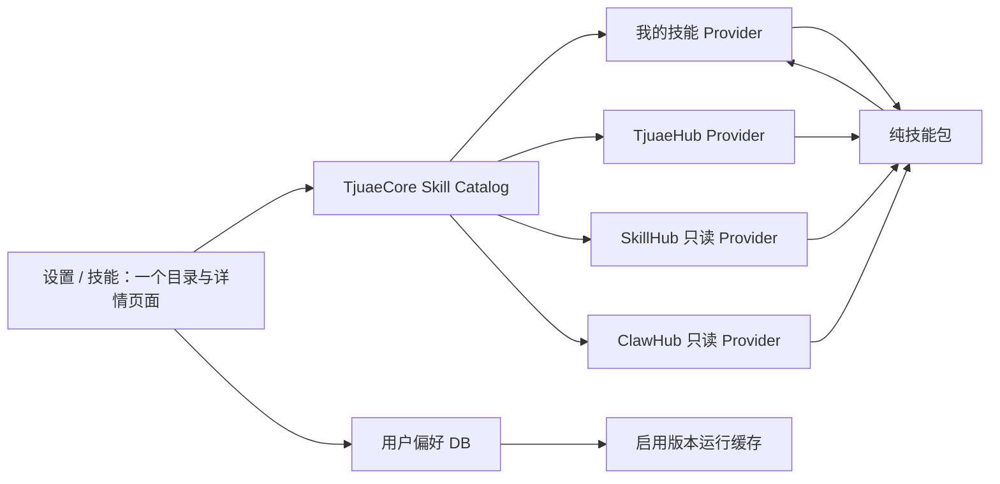
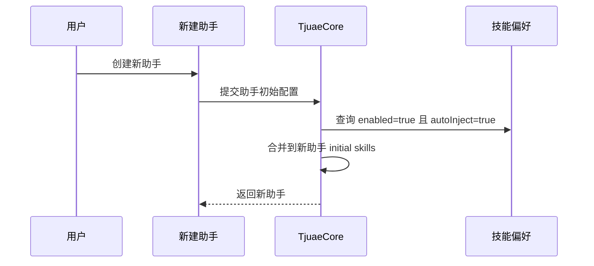

# Tjuae 技能目录最终方案

## 1. 目标与边界

技能系统采用一个目录页、一个轻量详情页、一套 Core 目录协议和一种公共技能包。

本方案只解决用户真正需要的五件事：

1. 在“我的技能 / TjuaeHub / SkillHub / ClawHub”中统一搜索和浏览；
2. 查看同一来源、同一技能的文件、版本和两个版本之间的差异；
3. 对任意来源的精确版本启用、停用，并决定它是否自动加入新建助手；
4. 把任意远程版本复制成“我的技能”，或把纯技能 ZIP 导入“我的技能”；
5. 导出不含任何用户状态的纯技能 ZIP；具有开发权限时可编辑 TjuaeHub 或将“我的技能”移入 TjuaeHub 工作副本。

不建设“市场”导航，不把技能详情强制做成 Workbench，不做跨来源比较，不把外部 Hub 适配成完整双向协作系统，也不保留旧技能协议、旧安装页或旧兼容路由。

## 2. 唯一信息架构



四个来源只提供数据，不创建四套页面：

| 来源     | 浏览 | 版本/文件/比较   | 编辑           | 复制到我的技能 | 启用/自动注入 | 导出 |
| -------- | ---- | ---------------- | -------------- | -------------- | ------------- | ---- |
| 我的技能 | 是   | 是；当前工作版本 | 是             | 不适用         | 是            | 是   |
| TjuaeHub | 是   | 是               | 有开发权限时是 | 是             | 是            | 是   |
| SkillHub | 是   | 是               | 否             | 是             | 是            | 是   |
| ClawHub  | 是   | 是               | 否             | 是             | 是            | 是   |

任一 Provider 不可用时只影响该来源。其他来源、已启用的运行缓存和本地技能仍然可用。

## 3. 两条用户动线

### 3.1 普通用户

- 在一个总搜索框中搜索全部来源、名称、说明、分类和标签；
- 用来源、已启用、自动加入新助手三个条件过滤；
- 进入任意技能详情，切换该来源提供的版本，浏览文件和说明；
- 只在当前来源和当前技能内选择两个不同版本进行比较；
- 直接启用任意来源的精确版本，不要求先下载或复制到“我的技能”；
- 将“自动加入新助手”打开后，它只影响之后创建的新助手；
- 将任意来源的精确版本复制成新的“我的技能”；
- 导出任意来源的精确版本为纯 ZIP；
- 将纯 ZIP 导入“我的技能”。

### 3.2 TjuaeHub 开发者

开发权限是 Core 根据开发模式和本机 TjuaeHub 工作副本判定的能力，不是 UI 自行假定的角色。

开发者在普通用户能力之外可以：

- 编辑 TjuaeHub 工作副本中的技能文件；
- 由 Core 在保存后重新计算 `_meta.json.contentHash`；
- 把“我的技能”的当前版本原子复制到 `TjuaeHub/skills/<slug>`；
- 后续使用 TjuaeHub 仓库本身的 Git 审核、提交和发布流程。

TjuaeUI 不内置 GitHub CLI，不替用户安装第三方 CLI，不把 Git 凭据、分支或提交写进技能包。

## 4. 页面交互

### 4.1 目录页

目录页使用统一卡片，不使用推荐榜、下载榜或最近上新：

- 顶部：标题、导入 ZIP、添加技能、刷新；
- 工具栏：总搜索、来源下拉、状态筛选；
- 卡片：图标、名称、来源、最新版本、说明、分类/标签、启用开关、自动加入新助手开关；
- 点击卡片进入同一个轻量详情组件；
- 自动加入新助手开关只有启用后可操作。

### 4.2 轻量详情页

所有来源共用四个页签：

1. **概览**：渲染 `SKILL.md`；
2. **文件**：紧凑文件栏 + 文本内容；有权限时可直接编辑保存；
3. **版本**：该来源、该技能的版本列表和精确版本切换；
4. **版本比较**：选择同一身份的两个不同版本，按文件查看增加、删除和修改。

详情页保留统一操作：复制到我的技能、导出、启用、自动加入新助手。只在能力允许时显示编辑、删除或移入 TjuaeHub。

版本比较的身份边界为：

```text
(source, namespace, slug)
```

比较 API 的路径已经固定身份，因此不存在跨 Hub、跨 namespace 或跨技能比较入口。

## 5. 唯一公共技能协议

每个技能包必须包含：

```text
<skill>/
├── _meta.json
├── SKILL.md
└── references/ scripts/ assets/ hooks/ README.md ...（可选）
```

`_meta.json` 是唯一公共清单，替代并删除 `.tjuae-skill.json`：

```json
{
  "$schema": "https://raw.githubusercontent.com/liangboqiang/TjuaeHub/main/schemas/tjuae-skill.v1.schema.json",
  "format": "agent-skill",
  "formatVersion": 1,
  "id": "example-skill",
  "version": "1.0.0",
  "categories": ["development"],
  "tags": ["example"],
  "compatibility": {},
  "requirements": [],
  "contentHash": "sha256-...",
  "extensions": {}
}
```

清单只描述可移植的技能本身。以下内容禁止进入 `_meta.json` 和导出 ZIP：

- `enabled`、`autoInject`、选中版本或跟随最新；
- 来源、Hub、远程 URL、namespace；
- 本地路径、运行缓存路径；
- Git 仓库、分支、提交或工作区状态；
- 用户、设备、账号或权限信息。

导入不接受旧清单，不进行双读或迁移；导出永远重新验证 `_meta.json`、`SKILL.md`、内容哈希、路径和大小限制。

## 6. 用户偏好与运行时

偏好存储在数据库中，主键是：

```text
(source, namespace, slug)
```

字段只有：

```text
selectedVersion, followLatest, enabled, autoInject
```

约束：

- `autoInject=true` 必须同时 `enabled=true`；
- 同一运行时 `slug` 只能有一个来源/版本处于启用状态；
- 启用远程技能时，Core 把精确版本物化到内部运行缓存，不复制到“我的技能”；
- 运行只读取已经校验的本地目录或内部缓存，不在对话过程中访问 Hub；
- 停用不会删除“我的技能”，也不会改变公共技能包。

### 自动加入新助手的唯一语义



它与新建会话、已有会话、首条消息或每次运行无关。已有助手不会被后台改写。

## 7. Core API

```text
GET    /api/skills/catalog
GET    /api/skills/catalog/{source}/{namespace}/{slug}?version=...
GET    /api/skills/catalog/{source}/{namespace}/{slug}/file?path=...&version=...
PUT    /api/skills/catalog/{source}/{namespace}/{slug}/file
GET    /api/skills/catalog/{source}/{namespace}/{slug}/compare?base=...&target=...
PUT    /api/skills/catalog/{source}/{namespace}/{slug}/preferences
POST   /api/skills/catalog/{source}/{namespace}/{slug}/copy-to-mine
POST   /api/skills/catalog/{source}/{namespace}/{slug}/export
POST   /api/skills/catalog/mine/{namespace}/{slug}/publish-to-tjuae-hub
POST   /api/skills/import
POST   /api/skills/create
DELETE /api/skills/catalog/mine/{namespace}/{slug}
```

UI 不处理 SkillHub 或 ClawHub 的原始响应，只消费 `SkillCatalogItem`、`SkillCatalogDetail`、`SkillFile`、`SkillVersion` 和 `SkillVersionComparison`。

## 8. TjuaeHub

TjuaeHub 是官方远程市场，但不需要独立前端或运行中的市场服务器：

- `skills/<slug>` 保存官方公共技能包；
- `schemas/tjuae-skill.v1.schema.json` 是公共包协议；
- 构建脚本校验 `_meta.json`、`SKILL.md`、内容哈希和文件安全；
- `dist/skills.json` 提供 `latestVersion` 和 `versions[]`；
- 每个版本包含 revision、digest、readme 和文件索引；
- Core 在用户导出/复制/启用时按索引读取并重新验证内容。

TjuaeHub 不存放用户偏好，也不在 Core 内嵌重复 ZIP。

## 9. 安全规则

- 单文件、总包大小和文件数量设上限；
- 拒绝绝对路径、`..`、反斜线绕过、符号链接和 ZIP 路径穿越；
- `_meta.json.id` 必须与技能目录一致；
- `contentHash` 必须覆盖除 `_meta.json` 自身外的全部公共文件；
- 远程文件哈希与索引不一致时拒绝启用、复制或导出；
- 写入使用临时目录和原子重命名，失败时不留下半个技能；
- 外部 Provider 只读，超时或协议变化时返回来源级错误。

## 10. 删除项

- `.tjuae-skill.json` 双读、双写和迁移兼容；
- Core 内嵌的旧官方技能 ZIP 与旧 `skills.json`；
- 技能包内的来源、启用和自动注入字段；
- 会话级自动注入、排除列表和首消息重新解释；
- “下载/安装后才能启用”的市场模型；
- 跨来源、跨技能或跨 namespace 比较；
- 独立“市场”导航；
- 技能 Workbench、Butler 侧栏和旧技能详情路由；
- 推荐、下载量、最近上新排序；
- GitHub CLI 或第三方 CLI 安装逻辑。

## 11. 验收标准

1. 四个来源共用同一目录、卡片、详情和路由模型；
2. 总搜索可覆盖所有来源、分类、标签和文本；
3. 任意来源均可直接启用和设置自动加入新助手；
4. 自动加入只改变之后新建助手的初始技能，绝不改变会话；
5. 版本切换、文件浏览和比较在四个来源中使用同一交互；
6. 比较只能提交同一 `(source, namespace, slug)` 的两个不同版本；
7. 复制精确版本会创建独立“我的技能”，不保留来源状态；
8. 导入/导出的 ZIP 只包含公共技能文件，且只有 `_meta.json` 清单；
9. TjuaeHub 开发权限可编辑工作副本并将我的技能移入 Hub；
10. 旧协议、旧内嵌 ZIP、旧安装/同步/市场代码和旧详情组件无残留；
11. Core、UI、Hub 聚焦测试、类型检查、国际化检查和运行时验收全部通过。
