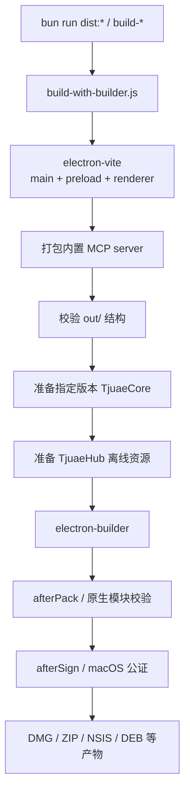

# 构建与运维脚本

`scripts/` 保存 TjuaeUI 的开发启动、打包、发布资源准备、安装器验证、WebUI 和基准测试脚本。命令入口以根目录 `package.json` 为准。

## 主要脚本

| 脚本                                   | 用途                                                   |
| -------------------------------------- | ------------------------------------------------------ |
| `build-with-builder.js`                | 协调 electron-vite、资源准备与 electron-builder        |
| `rebuildNativeModules.js`              | 统一处理原生模块重建与二进制校验                       |
| `afterPack.js`                         | 打包后校验与平台专用原生模块处理                       |
| `afterSign.js`                         | macOS 签名后的公证流程                                 |
| `prepareTjuaeCore.js`                  | 按版本和目标平台准备 TjuaeCore 可执行文件              |
| `prepareHubResources.js`               | 准备 TjuaeHub 索引与扩展包，供离线回退                 |
| `webui.ts`                             | 启动 WebUI 开发或生产服务                              |
| `resetpass.ts`                         | 重置 WebUI 用户密码                                    |
| `generate-i18n-types.js`               | 根据参考语言生成 i18n 键类型                           |
| `check-i18n.js`                        | 校验语言目录、键一致性、硬编码调用与类型同步           |
| `prepare-release-assets.sh`            | 整理 Release 产物                                      |
| `verify-release-assets.sh`             | 校验 Release 文件集合                                  |
| `smoke-installer-*.js`                 | 验证 Windows 安装器失败、锁文件与 Restart Manager 场景 |
| `benchmark-*.ts` / `run-benchmarks.ts` | 启动、ACP 与综合性能基准                               |

## 桌面构建流程



构建脚本会执行以下关键门禁：

1. 确认 `package.json.main` 指向 electron-vite 输出
2. 构建或复用经过 hash 校验的 `out/`
3. 将内置 MCP server 打包为自包含 CJS
4. 拒绝缺失 renderer 资源等不完整产物，避免安装后白屏
5. 根据 `tjuaeCoreVersion`、目标平台与架构准备 TjuaeCore
6. 下载 TjuaeHub 索引和扩展包作为本地回退
7. 通过 electron-builder 生成安装包；发布动作由独立 CI job 处理

## 常用命令

### 只构建应用代码

```bash
bun run package
```

输出：

```text
out/
├── main/
├── preload/
└── renderer/
```

### 构建当前平台安装包

```bash
bun run dist
```

### 指定平台或架构

```bash
bun run dist:mac
bun run dist:win
bun run dist:linux

bun run build-mac:arm64
bun run build-mac:x64
bun run build-win:arm64
bun run build-win:x64
```

### 增量与调试参数

可以直接向 `build-with-builder.js` 传递：

| 参数            | 行为                                                   |
| --------------- | ------------------------------------------------------ |
| `--skip-vite`   | `out/` 存在且源码 hash 未变化时复用 Vite 产物          |
| `--skip-native` | 跳过原生模块重建；只适用于已经确认二进制匹配的本地调试 |
| `--pack-only`   | 完成 Vite/MCP 构建与校验后停止，不生成安装包           |
| `--force`       | 忽略增量缓存，强制完整构建                             |

示例：

```bash
node scripts/build-with-builder.js x64 --win --x64 --force
```

## TjuaeCore 版本解析

`prepareTjuaeCore.js` 按以下顺序确定来源：

1. `TJUAEUI_BACKEND_RUN_ID`：下载指定 TjuaeCore Manual Build workflow 产物
2. `TJUAEUI_BACKEND_VERSION`：临时覆盖版本
3. 根目录 `package.json` 的 `tjuaeCoreVersion`

相关环境变量：

- `TJUAEUI_BACKEND_ARCH`：目标架构；优先于 `npm_config_target_arch` 与当前进程架构
- `GH_TOKEN` / `GITHUB_TOKEN`：GitHub API token

版本必须是固定标签；解析器会拒绝 `latest`。

## TjuaeHub 资源

`prepareHubResources.js` 将 `index.json` 与扩展 zip 放入 `resources/hub/`。

- 根目录 `package.json` 的 `tjuaeHubRef`：固定的 40 位分发提交哈希
- `TJUAEUI_HUB_REF`：仅用于临时覆盖固定提交，同样必须是完整提交哈希
- `TJUAEUI_HUB_SKIP=1`：跳过 Hub 资源准备

脚本会对每个扩展执行 SHA-256 完整性校验，任何缺失或损坏都会阻断构建。这些文件是应用内的离线回退，不替代在线更新检查。

## 原生模块

### 本地安装

`postinstall.js` 在本地通过 `electron-builder install-app-deps` 为当前 Electron 版本准备原生依赖；CI 优先使用预编译二进制，由打包流程完成后续处理。

### 打包后

`afterPack.js` 与 `rebuildNativeModules.js` 负责：

- 校验 `better-sqlite3` 等原生二进制存在
- 在需要的平台/架构上重建不匹配的模块
- 确保最终文件位于 `app.asar.unpacked` 对应位置

不得在多个脚本中复制原生模块重建逻辑；统一扩展 `rebuildNativeModules.js`。

## 故障排查

### `Cannot find module 'better-sqlite3'`

检查：

1. 依赖是否包含在 `packages/desktop/electron-builder.yml` 的 `files`
2. 原生文件是否包含在 `asarUnpack`
3. `postinstall` 是否完成
4. `afterPack.js` 是否成功

### 启动时发生二进制不兼容或崩溃

1. 确认目标架构与安装包架构一致
2. 重新运行 `bun install`
3. 不要使用 `--skip-native`
4. 跨架构构建时优先在对应原生 runner 上构建

### Windows 打包文件被占用

关闭所有 `TjuaeUI.exe` 和 Electron 开发实例后重试。构建脚本会尝试清理常见锁定场景，但不会在无法确认目标时删除目录。

### macOS DMG 偶发失败

脚本会保留已生成的 `.app`，并以 `--prepackaged` 重试 DMG 阶段。持续失败时检查 `hdiutil`、签名与 runner 磁盘状态。

## 修改脚本时

1. 至少验证受影响的平台和架构
2. 行为变化后同步更新本文
3. 保持 TjuaeCore 与 TjuaeHub 版本来源可追踪
4. 不复制原生模块重建逻辑
5. 错误信息必须说明失败阶段和用户下一步
6. 发布脚本不得隐式执行上传；实际发布由 CI 的独立 Release job 完成
